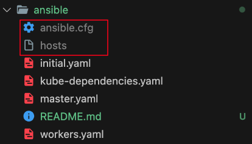

# Ansible

## Requirements



- [엔서블 설치](https://docs.ansible.com/ansible/latest/installation_guide/intro_installation.html)
- `ansible.cfg` 파일 생성 - 괄호는 없이 작성하세요
    ```cfg
    [defaults]
    host_key_checking = False
    private_key_file = {생성한 키 경로}
    remote_user = {my_id}
    ```
- `hosts` 파일 생성 - 괄호는 없이 작성하세요
    ```
    [masters]
    master ansible_host={생성된 vm public ip} private_ip={생성된 vm private ip} ansible_user={my_id}

    [workers]
    worker1 ansible_host={생성된 vm public ip} private_ip={생성된 vm private ip} ansible_user={my_id}
    worker2 ansible_host={생성된 vm public ip} private_ip={생성된 vm private ip} ansible_user={my_id}
    ```

## Command

- `ansible-playbook -i hosts initial.yaml`
- `ansible-playbook -i hosts nfs.yaml`
- `ansible-playbook -i hosts kube-dependencies.yaml`
- `ansible-playbook -i hosts master.yaml`
- `ansible-playbook -i hosts workers.yaml`