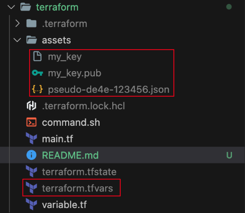

# Terraform

## Requirements



- [테라폼 설치](https://developer.hashicorp.com/terraform/tutorials/aws-get-started/install-cli)
- [ssh 키 및 GCP Service Account 생성](https://docs.google.com/presentation/d/1oTTSVRX9fK8sDZ4qC83s2BPVPV-RKry6C4TABuvN360/edit#slide=id.g27d2920a986_0_0)
- `terraform.tfvars` 파일 생성
    ```terraform
        iam_user_name = "my_id"
        my_project_id = "pseudo-de4e-123456"
    ```

## Command

- `terraform init`
- `bash command.sh`
- `yes`